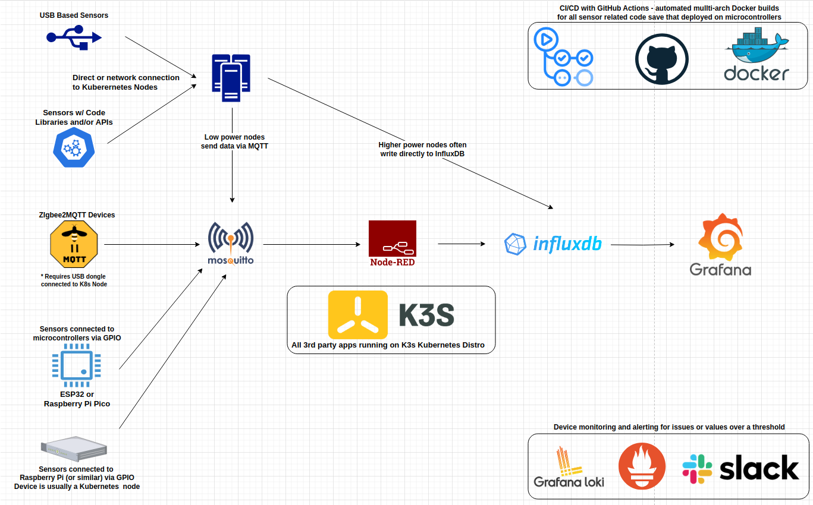

## IoT Overview

This folder contains code for capturing data from a variety of sensors and smart devices, and then either writing that data to InfluxDB or transmitting it via MQTT. Save code deployed on microcontrollers (e.g. ESP32 or Raspberry Pi Pico), all the code is containerized and nearly always deployed/orchestrated/managed via Kubernetes. The "iot_libraries" folder contains code for common functions like MQTT, Slack Alerts and writing to InfluxDB, each device folder contains the code specific to that device. At the moment all the devices are of the "data collection" variety, gathering climate data (air quality, humidity, temperature), power consumption information and the like. 

### CI/CD Details

For code deployed via containers pushing updates to GitHub triggers an action that builds a mutli-arch Docker image (when applicable, they're often just ARM64), and then pushes the updated image to Dockerhub. For the moment microcontrollers are reflashed/updated manually and I'm currently investigating methods for OTA updates, the goal would be something automated where pushing code updates to GitHub triggers the OTA changes.

  
*Note #1: while this architecture includes the IoT tech stack's full data collection capabilities, but not all of them are used for this specific project, some (microcontrollers) are used for other projects that aren't technically part of this one but use its tech stack/infrastructure. E.g., [MicroPython code for a Raspberry Pi Pico](https://github.com/MarkhamLee/HardwareMonitoring/tree/main/case_temps_rpi_pico) gathering intake, interior and exhaust temps for a PC case* 

*Note #2: while not pictured here, hardware telemetry makes use of the above stack as well. All nodes attached to the Kubernetes cluster have containers running on them gathering hw temperature data and utilization data. For small or arm64 based nodes that data is sent out via MQTT and for the rest the data is written directly to InfluxDb. In the future the plan is for all devices to send out data via MQTT so that two way communication is possible/enable better HW management.*

As one can see in the diagram that are currently five paths or types of IoT Devices currently supported by this platform:

* **USB Based Sensors:** while this could be connected to any device, they're usually connected to Raspberry Pis (or similar) that are part of the Kubernetes cluster. These devices are located throughout the house and are also general worker nodes in addition to gathering data from the device(s) plugged into their USB ports. 

* **APIs & Code Libraries:** these are devices that either have a customer accessible API and/or a code library has been created (often unoffocial community creations) that allow users to directly access the device without having to use an associated cloud service. Currently, this just applies to the Kasa Smart Plugs used to monitor the power consumption of the Kubernetes cluster and its associated hardware. 

* **Zigbee2MQTT:** is an [open source community creation](https://www.zigbee2mqtt.io/) to allow people to interact with Zigbee based devices without the need for a proprietary hub, cloud service, etc. [Zigbee is a low-power mesh network protocol](https://csa-iot.org/all-solutions/zigbee/) used to network embedded or IoT devices without the need for Wi-Fi or a local network.This "path" is currently being used to gather data from temperature and humidity sensors and a number of smart plugs located through my home. The smart plugs also serve as "Zigbee Routers" that relay signals from nearby battery powered Zigbee devices. 

* **GPIO Sensors - Microcontrollers:** these are either ESP32 or Raspberry Pi Pico devices. I'm effectively flashing the device with custom code that allows it to capture data from a connected sensor and then transmit the data via MQTT. The advantage here is that these devices are very small and inexpensive, and are often better suited for capturing sensor data than a Raspberry Pi, which is larger, more expensive and often under-utilized for this purpose. E.g.,a ESP32 or Raspberry Pi Pico + breakout board is about $10-$12 vs $75-$80 + the cost of accessories for a Raspberry Pi 4B, 5 or similar.

* **GPIO Sensors - Raspberry Pis:** similar to the above, sensors plugged into the GPIO pins of a Raspberry Pi or similar device, typically to gather climate related data. These "nodes" are part of the Kubernetes cluster with the code for each sensor running on Docker containers, and the nodes also run general purpose workloads in addition to collecting data from their connected sensors. 

### Future Plans: 
* **Add CO2 sensors:** tested an SPG30 sensor and found the results inconsistent, recently purchased MH-Z19B CO2 sensors that I will probably deploy attached to microcontrollers. 
* **Update Nova PMSDS011 sensor control:** update the control code so they warm-up take a few readings over the course of a few minutes and then for 10-20 minutes. I also want to have the sleep period decreased in instances where bad air quality is detected, i.e., run continuously until air quality improves.
* **Improved storage for the Raspberry Pis:** at the moment all the Raspberry Pis are using shared storage from Kubernetes via Longhorn, which takes quite a bit of stress off of their internal storage since all their workloads (aside from system related things) are Kubernetes related and the main I/O is over the network. Of the three Raspberry Pis only one boots from an NVME and the other two boot from mini SD cards, the plan is to either switch the other two to NVME hats OR set them up to boot over the network. 
* **Rewrite all sensor code currently in Python in C++:** while this isn't explicitly neccesary it is a good skills development exercise, and it will allow me to potentially move all the sensor code to microcontrollers, make my entire setup more energy efficient and potentially free up the Raspberry Pis for other projects.
* **Develop a good method for OTA updates for the microcontrollers:** the idea here is to come up with a good solution for testing and then pushing updates to the microcontrollers whenever I update the sensor related code, similar to what I have for the Rasperry Pis with GitHub Actions and Kubernetes.
* **Setup MQTT topic(s) and possibly a microservice for microcontroller logging:** the idea would be that certain events would be sent out via MQTT to a container running on Kubernetes, which could serve as proxy to the [Loki-Grafana](https://github.com/MarkhamLee/kubernetes-k3s-data-and-IoT-platform/blob/main/deployment_files/application_install_files/loki_stack/install_instructions.md) logging I'm currently using on my Kubernetes cluster.
