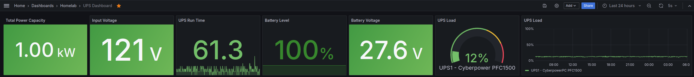

## Real Time Monitoring of UPS Devices

  

While the code in this container is targeted for the CyberPower PC PFC1500LCDa it will "likely" work for any UPS device being managed by Network Ups Tools (NUT), I just have it labeled for the 1500LCD as that's the device I currently own. I.e., as I add more UPS devices I will probably juse use the same container and just change a few variables in the Kubernetes deployment manifest before I deploy monitoring for that particular device: device_id, server IP if it's on a dfiferent NUT server, followed by pushing the manifest to the CIDCD repo that's monitored by Argo CD, which would then deploy a new monitoring container on my Kubernetes cluster. 

### Technical Basics

After getting NUT setup and managing my UPS, I begun looking into how to pull data off of it for display in a Grafana dashboard. After looking into into some code libraries, API wrappers and the like, it occured to me that it would be simpler to just run the Linux command line instruction to query your UPS on any machine with the NUT client installed from within Python. Namely: 

~~~
upsc ups_name@nut-server-ip-address  e.g., upsc myups@192.168.99.99
~~~

Using the Python subprocess library you can run bash commands from within a Python script and convert the outputs to a dictionary:

~~~
import subprocess as sp

# UPS_ID and UPS_IP being environmental variables for the device name
# and IP address of the server NUT is running on respectively

CMD = "upsc " + UPS_ID + "@" + UPS_IP  # e.g. upsc myups@192.168.99.99

data = sp.check_output(CMD, shell=True)
data = data.decode("utf-8").strip().split("\n")

# parse data into a list of lists, each pair of values becomes
# its own lists.
initial_list = [i.split(':') for i in data]

parsed_data = dict(initial_list)
~~~

Six lines of code and you have a Python dictionary you can easily convert to json and then export or write it into any data storage application of your choosing. No need for libraries, running an API layer or playing around with USB drivers. One thing to keep in mind is that the all the values in the dictionary are strings, so you'll need to convert some of them to floats or integers before exporting to the data store for your dashboard.