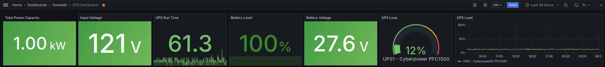

## Real Time Monitoring of UPS Devices

  

This container runs a small service that will periodically poll a NUT server connected to a UPS device and retrieve data for one of the UPS devices connected to it. This is intended to be deployed to at a 1:1 ratio of containers to UPS devices, i.e., even if a single NUT server is monitoring eight UPS devices, you would need to deploy a container for each UPS, not one container for each NUT server. 

Note: the folder is labeled for the CyberPower PFC1500LCD as that's the device it was used with/for, but it should work with any UPS that is compatible with NUT UPS monitoring software. Currently tested/verified UPS models include:

* CyberPower CP1500PFCLCD
* CyberPower CP1500PFCRM2U
* CyberPower CP1500AVRLCD3

The NUT configuration for UPS devices and the data exposed by NUT is fairly standardized so you shouldn't need to make any changes to this code to get it to work with UPS devices from other manufacturers, but prepared to make a tweak or two in something goes sideways. 


### Deployment

The deployment has two parts:

1. The NUT server the UPS is connected to (I'm using Raspberry Pis)
2. This container that connects to the RPIs to retrieve the data. The example below is for K8s but you can modify the example k8s manifest to be a Docker Compose easily enough. 

You'll also need to setup a Slack Channel and configure a Webhook via the Slack API so you can receive alerts. 

The deployments for each of my UPS monitoring containers is handled via pushing the K8s deployment manifest to GitHub where it's picked up and deployed to the K3s cluster via ArgoCD. 

### Onboarding a New UPS Device 

#### Configuring the NUT Server 

1. Plug the UPS into your NUT server via USB
2. On the NUT server run the following command to retrieve data on the newly added UPS device

`sudo nut-scanner -U`

This will show you connected UPS devices, look for one labeled similarly to the below

```ini

[nutdev1]

        driver = "usbhid-ups"
        port = "auto"
        vendorid = "0764"
        productid = "0601"
        product = "CP1500PFCRM2U"
        serial = "YOURUPS8675309"
        vendor = "CPS"
        bus = "001"
```

Note: the NUT server won't necessarily show the labels you've added for that specific unit, so a good idea is to run the command before you plug in the new UPS and then run it again so you can use the process of elimination to identify the right device. 

3. Run the following command to edit the file listing the UPS devices 

`sudo nano /etc/nut/ups.conf`

The command will open a file, scroll down to the bottom and add the data for the new UPS, the name in the brakets is the name you'll give to the UPS. 

```ini

[ups5] 
        driver = "usbhid-ups"
        port = "auto"
        desc = "CyberPower 1500PFCLDAa"
        vendorid = "0764"
        productid = "0601"
        serial = "YOURUPS8675309"
```

Save the file. 


4. Run the following command to restart NUT server so it picks up the updated config: 

`sudo systemctl restart nut-server`

#### Deploying the monitoring container to Kubernetes 


1. Edit the example deployment manifest to work with your setup. Key variables:

    * The NUT server IP and UPS device name 
    * MQTT broker topic, IP and secrets 

Note1: I selected MQTT instead of just writing directly to InfluxDB so I could have the flexibility to send messages back to the Raspberry Pi depending on the data coming from the UPS. I.e., in anticipation of future capabilities. 

Once that's complete, uploading the deployment manifest to the GitHub repo monitored by Argo CD will trigger the deployment of a container to monitor the new device.


### Technical Basics

After getting NUT setup and managing my UPS, I begun looking into how to pull data off of it for display in a Grafana dashboard. After looking into into some code libraries, API wrappers and the like, it occured to me that it would be simpler to just run the NUT client bash command you use to query UPS data from within Python:

~~~
upsc ups_name@nut-server-ip-address  e.g., upsc myups@192.168.99.99
~~~

Using the Python subprocess library you can run bash commands from within a Python script and convert the outputs to a dictionary:

~~~
import subprocess as sp

# UPS_ID and UPS_IP being environmental variables for the device name
# and IP address of the server NUT is running on respectively

CMD = "upsc " + UPS_ID + "@" + UPS_IP  # e.g. upsc myups@192.168.99.99

data = sp.check_output(CMD, shell=True)
data = data.decode("utf-8").strip().split("\n")

# parse data into a list of lists, each pair of values becomes
# its own lists.
initial_list = [i.split(':') for i in data]

parsed_data = dict(initial_list)
~~~

Six lines of code and you have a Python dictionary you can easily convert to json and then export or write it into any data storage application of your choosing. No need for libraries, running an API layer or playing around with USB drivers. One thing to keep in mind is that the all the values in the dictionary are strings, so you'll need to convert some of them to floats or integers before exporting to the data store for your dashboard.