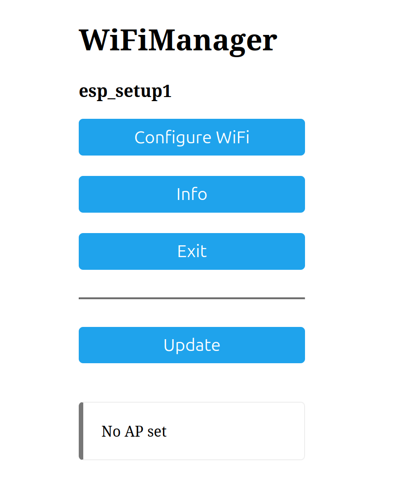
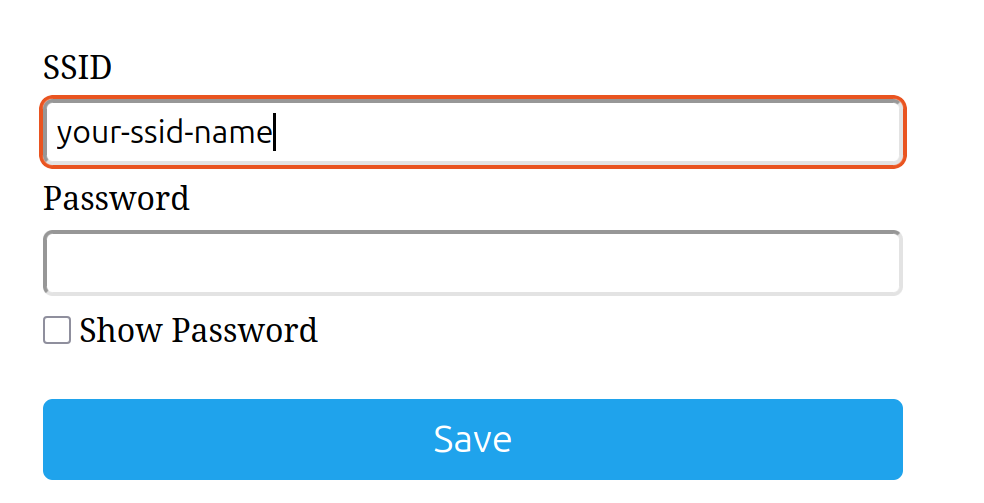

## ESP32 Setup Sketch

The purpose of this sketch is to make it really simple to provision an ESP32 device with Wi-Fi creds or any other basic information it needs to operate on your network, send data to your broader systems, etc. Think of it as being akin to setting up a new server or dev environment. A couple of things to keep in mind:

1) You'll need to run this twice, once to load and save the data on your ESP32 and another to turn off the bits that request/save/erase past data so unplugging the device from your laptop or power doesn't put you back to square one.
2) These instructions are based on using Platformio with VS Code, so while some of the same principles apply, you'll need to modify the specific steps to fit that IDE. 
3) I nearly always run this sketch while the device is connected to one of my Linux (Ubuntu) boxes, so while the environmental varible bits should work with Windows as well, you may run into some issues. 
4) When you connect to the ESP32 device while connected to a breakout board, connect directly to the device via USB as that connetion will provide power and data, while the breakout board USB ports only provide power. 

### Key Steps 

1) Add the environmental variables you want to store on the ESP32 to your local environment. 
2) Add the variable names to the platformio.ini file as per the below, notice the "-D" you need to put in front of the environmental varible name, with no spaces, it's similar to using "$VAR_NAME" in Linux.

~~~
build_flags =
	-DMQTT_USER=\"${sysenv.MQTT_USER}\"
	-DMQTT_SECRET=\"${sysenv.MQTT_SECRET}\"
	-DMQTT_HOST=\"${sysenv.MQTT_HOST}\"
~~~

3. When you open the folder in Platformio using the same platformio.ini file as I have this in tihs repo, it will automatically populate the libraries/dependencies for you.
4. Once you have things ready to go, upload the code to the device, it will compile the code and then upload the binary to your device. 

5. Once the upload is finished click the monitoring icon at the bottom of the screen so you can keep an eye on your progress.

6. Firing up the device will cause it to spin up a local Wi-Fi network, which whose SSID name will be the same first parameter in the block of code  below followed by the password, which is the 2nd parameter.

~~~
    bool res;
    res = wm.autoConnect("esp_setup1", "password");
~~~

7. When you connect to it, you'll enter the password (in this case, it's "password") and then Wi-Fi capture will take you to a screen like the below: 

  

8.  Click "Configure WiFi" and you should see a list of available networks, if you don't just click back and try again. 

9. Clicking the name of an SSID will populate it into the box below, just enter in your creds and connect. 

  

10. After the above the device will load and save the MQTT creds, connect to the broker and send the test payload every 5 seconds. 

11. Comment out the relevant parts and re-load the sketch, once you've verified that the payloads are coming through I would connect the device to a non computer power source and verify that the data still comes through. 