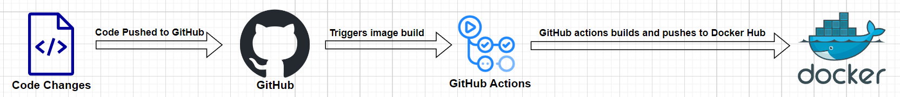
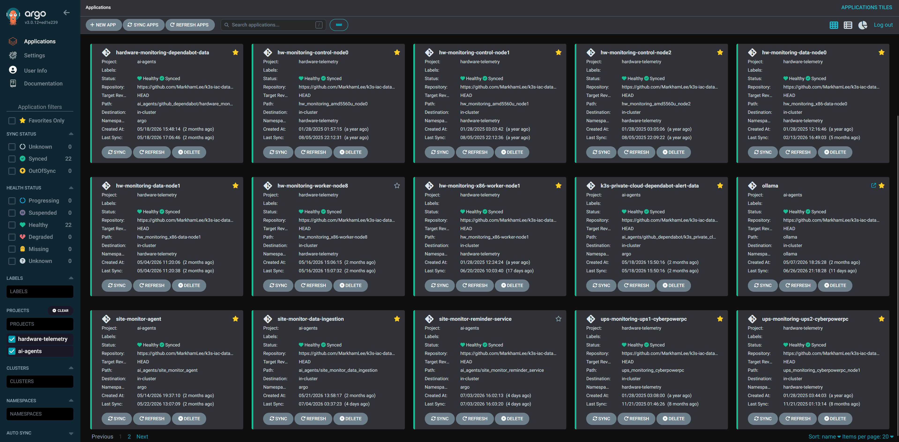
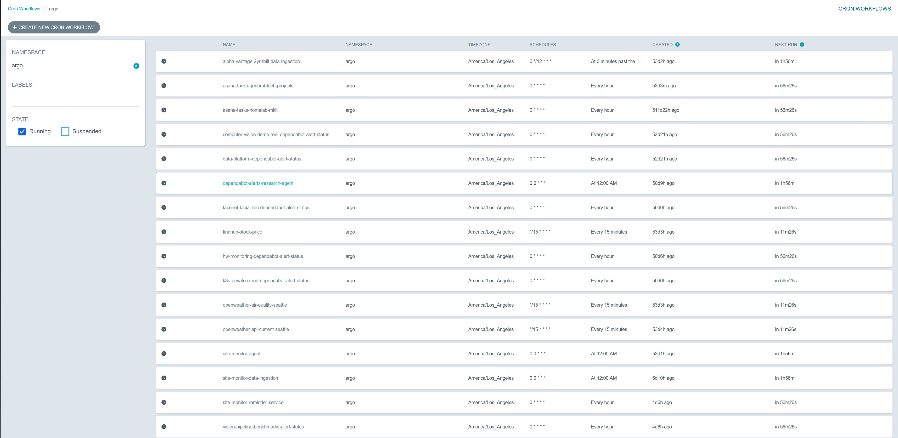
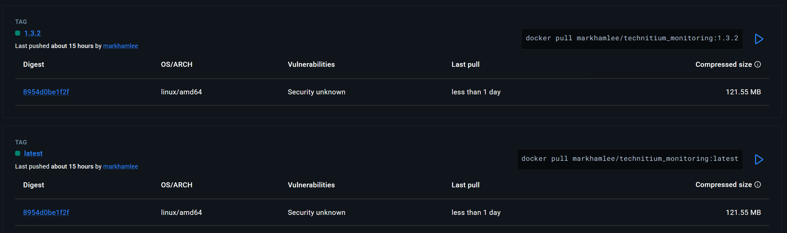
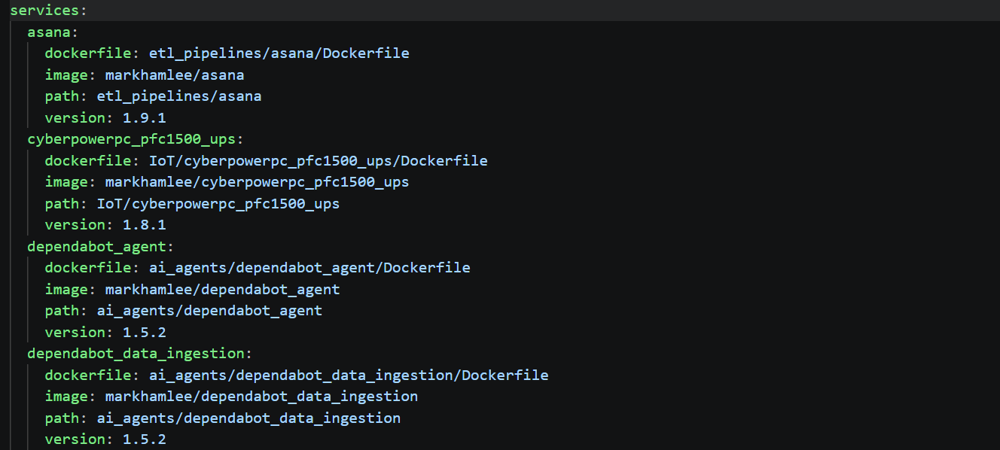

## CICD for Custom Code

All custom code that runs on either K3s or stand-alone servers is built and deployed as Docker containers, including custom code for IoT Devices, data ingestion, agentic workflows and task based items like cron jobs and ETLs. 

### Build Process
Container builds are fully automated via GitHub Actions, pushing new code to GitHub triggers an image build that is then pushed to Docker Hub, but could also (if needed) be pushed to other container registries. Each container is built using a two stage build process to minimize the size of the image and reduce the security risk surface area. 

 *Note: after fine tuning this approach for this project, I then used it on production/work projects as well, just with the containers landing in AWS ECR instead of Docker Hub*

### Deployment

Containerized, custom workloads fit into two categories: 
* **Continuously running services:** e.g., monitoring IoT devices, these services are deployed directly to K3s or to stand-alone servers. When a new container image for a service is deployed to the container registry, redeployment is triggered manually via ArgoCD. The manual step ensures that deployment manifersts, sensor hardware, etc., are ready to go before a new container is deployed. 
* **Task Based Services:** e.g., ETLs that run on a schedule. Currently, these services are only deployed to K3s where Argo Workflows is used for task orchestration. When a new container is published to the registry, the task will (usually) pull the latest container, ensuring that the Agentic Workload, ETL, etc., will use the latest features the next time the task runs. 

For both types of workloads, semantic versioning can be used to "pin" a deployment to a specific container as a safeguard against breaking changes. 

Custom code workloads have two GitOps components:
* The repo where the code lives, AKA this repo 
* A separate, private repo that holds Infrastructure As Code (IAC) in the form of Kubernetes Manifests or Docker Compose files. 

This separation of concerns is in accordance with best practices and makes it easier to manage building vs deploying. ArgoCD is used to deploy workloads to the K3s cluster:
1) ArgoCD monitors the IAC repo and any changes to the manifests for an application will be detected and the application will be updated accordingly. 
2) ArgoCD uses GitHub as the source of truth, any changes made to the application via Kubectl or the Rancher UI will be "healed" and the app reverted back to its state as defined in GitHub. 

The above pattern is used for deploying both continuously running services and task based services, ArgoCD applies a deployment manifest for former and a Argo Workflow cron job for the latter. 

#### Agentic, ETL and other Task Based Services 

Task and scheduled based services all run on K3s via Argo Workfolows The cron job is "loaded" into Argo Workflows via a cron job manifest (specific to Argo Workflows) that is stored in a GitHub repo for IAC that is being monitored by ArgoCD. When a manifest is changed or added, ArgoCD will pick those changes up and apply them to the K3s cluster for Argo Workflows to use. 

These tasks are nearly always deployed using the "latest" image tag so that the next time the job runs the most up to date version of the container is used. In instances where cron job manifest is pinned to a specific image version, the cron manifest will have to be updated and then pushed to GitHub so that ArgoCD can push those changes to Argo Workflows.

### Versioning
Semantic versioning is handled by a "VERSION" file in the folder containing the code for each container, updating a container's code also requires incrementing the version file so that the build process has the updated container version. Semantic versioning provides the following benefits:

* The most obvious is being able to roll back to an earlier service version if the latest version causes breaking changes 
* The use of shared components means that sometimes breaking changes can be introduced that will require updates across several ETLs, IoT tasks, etc., pinning to a specific version means we can prevent breaking changes from being introduced to a task or job until it's code has been updated. 

A repo wide GitHub action scans all the VERSION files and produces a [registry file](../container_versions_generated.yaml) listing all the containers in the registry that are built using semantic versioning. 

### Container Architecture(s) 

* Custom containers that are targeted exclusively for deployment on K3s are built for x86 architecture only 
* Containers that could be deployed to K3s or to stand-alone devices (e.g., IoT Monitoring related) are built to run on ARM and x86 architectures. 

### Additional Details

* The containers are built using shared or private library components for common tasks, which means that if a shared component is updated, all the containers that use it will automatically be rebuilt, thus ensuring that they can use the updated shared resources. The versioning approach is used to prevent breaking changes from updated shared components from breaking currently running containers or jobs.
* ESP32s don't currently use a automated CICD process, the devices are just plugged into a computer and the firmware is flashed to the device via VS Code and PlatformIO. Future plans include moving to OTA updates for the EPS32s. 