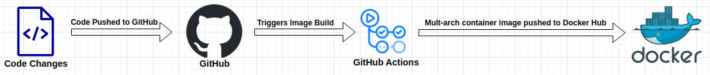
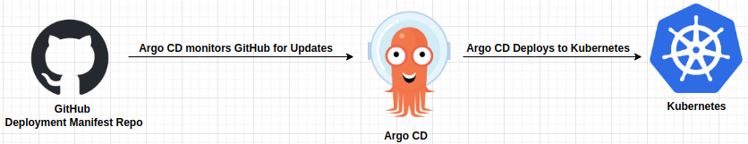
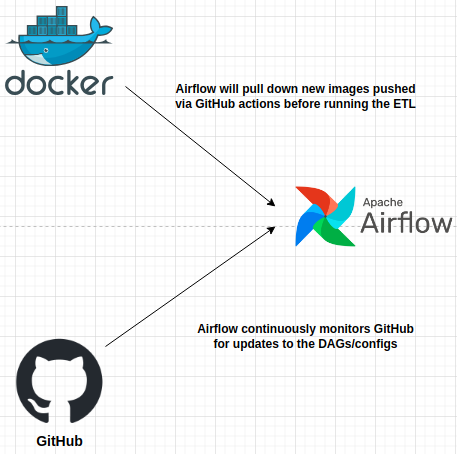

## CI/CD Overview

Given that this is a Kubernetes based project/data platform, it is important to remember that all deployed applications, containers, ETL pipelines, micro-services, et al., consist of two primary components: 

* App containers: docker containers containing the application’s actual code or bits, the focus of CI/CD for app containers is to manage code and build containers that the deployment process can pick up.  

* App configurations (or deployment manifests): these can be Directed Acyclic Graphs (DAGs) for Airflow or Argo Workflow, Kubernetes deployment manifests or any other type of file used to manage container deployments; these configuration files are written in YAML, save the Airflow DAGs, which are written in Python. The app configuration CI/CD is often more complex than the one for app containers, as there are two paths: 

    * Standard path: Argo CD is used to maintain/monitor a repo with app configs and will redeploy the app and/or deploy new instances of the app based on changes in the repo. 

    * Tools like Airflow maintain/monitor repos with their own app specific configs, in this instance these configs define the schedules, in addition to the usual items like environmental variables.  

Each application has two CI/CD pipelines: one for maintaining the app code and another for maintaining the configs, to keep things simple they are maintained in two separate repositories. While this may seem overly complex, the separation of code and config helps keep our folder structures simpler, avoid build and deploy loops and is just a cleaner process to manage. On a larger team this separation would also allow us to minimize the exposure people have to code and configs, you may not want the people managing deployments to have access to source code and vice-versa. I.e., only have access to what you truly need. 

#### App configs make it easy to maintain and deploy applications:  

* A lot of the micro-services for this platform are “one-to-many", e.g., a hardware or climate sensor monitoring docker image will be used to spin up a separate container for each device. An ETL image for the weather can be used to spin-up containers to monitor the weather for multiple areas. The configs make it quite easy to create additional deployments: duplicate the file, change the app name (and in some cases the node name), push it to GitHub and ArgoCD will deploy and monitor the application. 

* For services that are tied to a specific node (e.g., that node has a sensor plugged directly into it), the app configs make it easy to move an app from one node to another.  

### CI/CD Details

While there are differences between the CI/CD pipelines for API based data ingestion (ETL Pipelines) and those for IoT devices and other continuously running services, the core of each is the same: pushing updates to the code used by a particular image triggers a GitHub action that builds a multi-architecture image (where applicable) and then pushes it to Docker Hub:

From here the CI/CD pipelines diverge based on the specific needs of the type of application with respect to how and when the app is deployed. 

#### Continuously Running Services

These can be event-based apps that respond to an input, or apps that are used to monitor climate sensors or continuously collect data from a device like one of the Kubernetes nodes or an Uninterruptible Power Supply. Deployments can happen in one of two ways: 

* A change is made to the deployment manifest for an app and pushed to GitHub, where ArgoCD will pick it up and then automatically redeploy the app to Kubernetes. This typically includes general changes to the app configuration or adding additional deployments for climate sensors or hardware monitoring, e.g., adding air quality sensors in an additional room, deploying more UPS devices, etc. 

* After a change is made to the app code, the deployment is manually triggered via Argo CD. The reason for this is that these types of changes can require connecting sensors to a server or Kubernetes node, testing wires and connections, etc. I.e., the manual step is a safeguard against deploying code to a device that is not properly setup to run it.  

Argo CD is also used to maintain the state of 3rd party apps like Zigbee2MQTT, Node-RED, Eclipse-Mosquitto, etc. The process is identical, helm charts and/or Kubernetes deployment manifests are stored in GitHub for each app, when a change is made, image version updated, etc., Argo CD will re-deploy the app. Argo CD also protects against **"errant click ops"*, as any change made directly in Rancher without changing the manifests will be rolled back by Argo CD. I.e., a failsafe against an attempt to veer away from "infrastructure as code".

#### ETL Pipelines

While ETL management/scheduling tools like Airflow can run Python code directly (even on Kubernetes) that code is often difficult to test locally and cannot be run outside of Airflow; to address these issues all ETL pipelines are built as Docker containers so that they can be orchestration tool agnostic. Meaning: the same container can be run locally, via Airflow, Argo Workflows, Kubernetes cron jobs or any other tool that allows you to schedule/orchestrate containers, without having to write different code for each tool.

* Containers are built and tested locally, for more complex or new pipelines they may also be tested for a few days (or more) via Airflow, Kubernetes cron jobs or Portainer in a beta environment. 
* Once testing is complete the code is pushed to Github, which will trigger a GitHub Action that will build a multi-architecture image (amd64, arm64) and push it to Docker Hub. 
* The image build process is only triggered if the files used to build that particular image are updated.
* The new container(s) are then automatically picked by the ETL tool (Airflow or Argo Workflows) from Docker Hub the next time the pipeline runs. 

The ETL containers are updated/managed by the primary CI/CD pipelines for containerized workloads described above, from there, an ETL specific  pipeline is used to manage the app configs (DAGs) and deploying the ETL containers:

Code updates are automatically picked up by the orchestration tool the next time the ETL pipeline runs, and DAGs/deployment configurations are continuously synchronized with GitHub. Changes to an Airflow DAG are typically picked up within 2-3 minutes. This “can” cause issues where due to significant changes the DAG or the ETL code are out of synch with each other, e.g., if an ETL runs a new container before it has picked up a new DAG, but those situations are rare and can be handled by temporarily pausing a pipeline. ETL containers are often tested locally, but for more complex or new pipelines they may also be tested for a few days (or more) via Kubernetes cron jobs or Portainer in a beta environment.

### Future items & Ideas

* Given this is a learning exercise, will also experiment with other CI/CD tools in the future, current items on the list include:
    * GitLab
    * Jenkins
* Need to look into making the containers more modular and/or build the capability to update several images at once. E.g., changing the base image for a Python based container due to a security issue requires manually editing several Dockerfiles, need to create the ability to make one update that the rest of the Dockerfiles inherit.