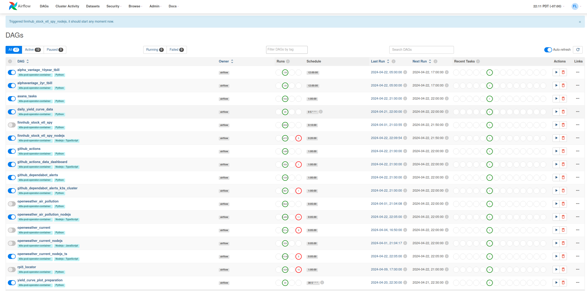
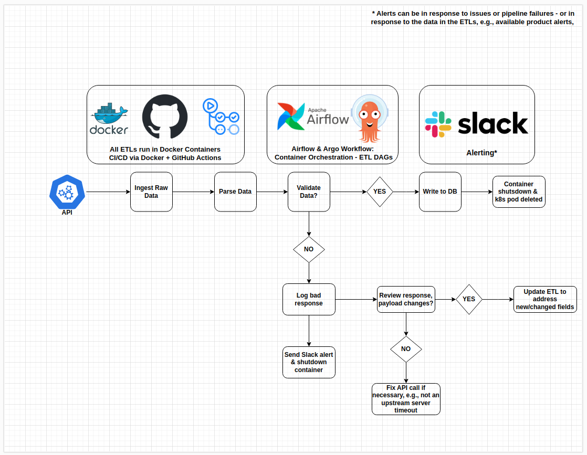

## ETL Containers & Scripts

**Airflow is the primary tool for managing ETLs**, however, since all ETLs are containerized, they can easily be run with other tools like **Argo Workflow**, **Kubernetes cron jobs,** or any other tool that allows you to schedule containerized workloads. 
  

### Typical End-to-End ETL Workflow
  

All the ETL pipelines have been built as Docker containers for a couple of reasons:

1) While I really like Airflow its DAG format isn't very portable and can be difficult to test locally, by moving to containers not only are my pipelines easier to test but they're now portable and can be used with a variety of different tools. 

2) Continuing from point #1... most ETL tools are really just orchestrators and schedulers, IMO, a good engineering practice (especiallty for data engineering) is to ensure that things are as portable and shareable as possible. I.e. once you have a working container, deploying it on Airflow vs Argo Worflow vs Kubernetes Cron Jobs is relatively easy, as you just need to edit what's usually no more than 1-2 dozen lines of a config or deployment file. 

This folder holds fully operational ETL containers, however, you'll need to acquire the API keys, setup the appropriate databases, populate environmental variables and configure a Slack webhook to receive pipeline failure alerts in order to use them. In keeping with the "Dockerized ETL" theme: while the majority of the pipelines are written in Python, I've added Node.js variants for most of the ones written in Python, you can find them [here](https://github.com/MarkhamLee/finance-productivity-iot-informational-weather-dashboard/tree/main/etl_pipelines_nodejs). In addition to the Node.js variants, I plan on adding some Scala versions in the very near future.

### CI/CD & Docker Build Notes

Github Actions is used for CI/CD automation, pushing updated files for an ETL pipeline to GitHub will trigger the rebuilding of its Docker image and then push it to Docker Hub, where it will be pulled down/used the next time the ETL pipeline runs. Each image is built for amd64 and arm64 architectures so it can be used by both architecture types in my Kubernetes cluster. *Note: currently, I'm only running these workloads on my arm64 devices, as its more energy efficient*

Nearly all of the ETL pipelines use common python scripts/private libraries for writing to DBs, logging, pulling data from certain providers, etc., so I've written the Dockerfiles to pull those scripts from common folders (E.g.,: "etl_library" and "openweather_library"). Used in conjunction with the CI/CD approach, this means that updating (for example) the script that writes to Postgres results in every image that uses that script being rebuilt when that code is pushed to Github. 

### Testing 
* The testing process is:
    * Use a unit testing library for the respective language (E.g. Jest for Node.js, Unittest for Python) to test the end to end ETL, plus ensure that exception handling and alert triggers are working properly.
    * Once the above was complete the updates would be pushed to GitHub, this would trigger the automated build process for the Docker images, from there the images would often be tested further via Portainer and/or K8s cron jobs before deploying them via Airflow or Argo Workflow.

**Future state:** I'm going to split out certain functions like writing to databases into separate *"etl component containers"*, this would enable ETL pipelines that use other languages for retrieving and/or preparing data to leverage existing Python code. CI/CD and build process would still work the same, as far as leveraging GitHub Actions to build container, using shared code/private libraries whenvever possible, etc.

Keep in mind that building Docker images from different folders like this from the CLI (namely from the parent folder the Docker file is in), is slightly tricky because when using the standard Docker build command, the Dockerfile can't copy files from the parent folder for security reasons. SO, to build the images you'll need to run the build command from the etl_pipelines folder so the parent folder is the "Docker build context": 

~~~
docker build -t openweather_airquality:latest -f openweather_air_quality/Dockerfile .
~~~

This command will set the parent folder with the common libraries as the "Docker build context", which will allow you to copy all the required files into your image. 

You can also build the multi-arch contaniers from the command line as well, as before this command needs to be run from the "etl_library" folder and you need to provide the path to the Dockerfile you want to use:

~~~
docker buildx build --push  --platform linux/arm64/v8,linux/amd64 --tag  markhamlee/openweather_current:latest --file openweather_current/Dockerfile .
~~~

This command would build linux containers for arm64 and amd64 architectures, modify it for building for other architectures and operating systems as you see fit.

### Deployment Notes

* The folder for each pipeline/data source will have a readme file that will list all the environmental variables you'll need to run the container. Meaning: API keys for data sources, secrets for databases, and other pieces of data you'll need for the pipeline to work.

* For the Slack alerts you'll need to sign-up for the [Slack API](https://api.slack.com/), create a channel for receiving pipeline alerts and a web hook to send alerts to that channel.

* I use the Loki Stack for aggregating/consuming logs, and configured all the containers to write logs to stdout so they can be picked up by Loki via Promtail 

* I stored all secrets in Kubernetes and stored all other env variables in Kubernetes config maps 

