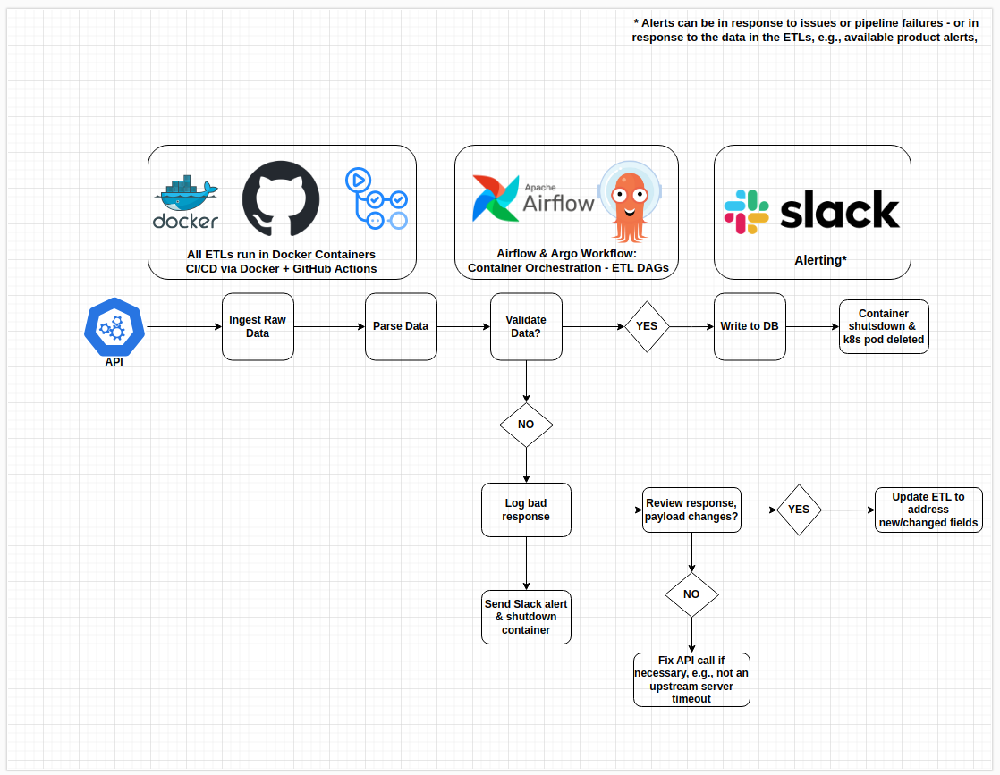

## ETL Containers & Scripts

When I first started this project back in '23 I was using Airflow for managing tasks, ETL type items, etc., and then started migrating everything to Argo Workflow in late '24. Because while I do slightly prefer the Airflow UI, the tool often needed to be redeployed and as a pain to manage. Comparatively Argo has been maintenance free and its integration into K8s means I can just deploy tasks, cron jobs and the like by dropping a manifest into a folder in Git and then pointing ArgoCD to it. 

The migration was fairly simple as I had already moved all my Airflow DAGs to Docker containers, as it made code maintenance and easier. e.g., Airflow DAGs are hard to test outside of Airflow. This meant that when it came to the migration, all I had to do was write an Argo manifest (nearly identical to a k8s cron job manifest) that can be deployed via applying to the cluster (using kubectl, Argo CLI, Argo UI or ArgoCD) and then make sure that the config maps and secrets were available to the Argo manifests. 

### Typical End-to-End ETL Workflow

  

This folder holds fully operational ETL containers, however, you will need to acquire the API keys, setup the appropriate databases, populate environmental variables and configure a Slack webhook to receive pipeline failure alerts to use them. In keeping with the "Dockerized ETL" theme: while most of the pipelines are written in Python, I have added Node.js variants for several of them, which you can find them [here](https://github.com/MarkhamLee/finance-productivity-iot-informational-weather-dashboard/tree/main/etl_pipelines_nodejs)

### CI/CD & Docker Build Notes

GitHub Actions is used for CI/CD automation, pushing updated files for an ETL pipeline to GitHub will trigger the rebuilding of its Docker image and then push it to Docker Hub, where it will be pulled down/used the next time the ETL pipeline runs. 
  
Nearly all of the ETL pipelines use common python scripts/private libraries for writing to DBs, logging, pulling data from certain providers, etc., so I've written the Dockerfiles to pull those scripts from common folders (E.g., "etl_library" and "openweather_library"). Used in conjunction with the CI/CD approach, this means that updating (for example) the script that writes to Postgres results in every image that uses that script being rebuilt when that code is pushed to GitHub.

### Testing
* The testing process is:
    * Use a unit testing library for the respective language (E.g. Jest for Node.js, Unittest for Python) to test the end-to-end ETL, plus ensure that exception handling and alert triggers are working properly.
    * Once the above was complete the updates would be pushed to GitHub, this would trigger the automated build process for the Docker images, from there the images would often be tested further via Portainer and/or K8s cron jobs before deploying them via Airflow or Argo Workflow.

### Future Plans 

* Build more network monitoring and alerting style tasks and ETLs 
* Enhance work flows with LLMs where appropriate 

### Building Images Manually

Keep in mind that building Docker images from different folders like this from the CLI (namely from the parent folder the Docker file is in), is slightly tricky because when using the standard Docker build command, the Dockerfile cannot copy files from the parent folder for security reasons. SO, to build the images you will need to run the build command from the etl_pipelines folder so the parent folder is the "Docker build context":

  
~~~

docker build -t openweather_airquality:latest -f openweather_air_quality/Dockerfile .

~~~

  

This command will set the parent folder with the common libraries as the "Docker build context", which will allow you to copy all the required files into your image.  

  

You can also build the multi-arch containers from the command line as well, as before this command needs to be run from the "etl_library" folder and you need to provide the path to the Dockerfile you want to use:  

  

~~~

docker buildx build --push  --platform linux/arm64/v8,linux/amd64 --tag  markhamlee/openweather_current:latest --file openweather_current/Dockerfile .

~~~

  

This command would build linux containers for arm64 and amd64 architectures, modify it for building for other architectures as you see fit.

  

###   Deployment Notes

  

* The folder for each pipeline/data source will have a readme file that will list all the environmental variables you will need to run the container. Meaning: API keys for data sources, secrets for databases, and other pieces of data you will need for the pipeline to work.

* For the Slack alerts you will need to sign-up for the [Slack API](https://api.slack.com/), create a channel for receiving pipeline alerts and a web hook to send alerts to that channel.  

* I aggregate log data with Victoria logs 

* I stored all secrets in Kubernetes and stored all other env variables in Kubernetes config maps.